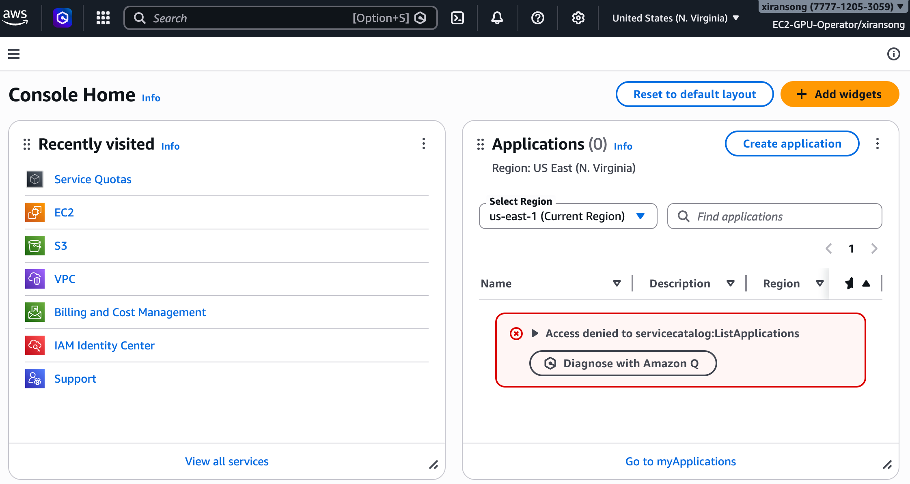

# User Guide

These pages walk through the supported `banglab-aws-tools` workflows.

Recommended order:

1. [Prerequisites](prerequisites.md)
2. [Local Machine Setup](local-machine-setup.md)
3. [SSH Access Setup](ssh-access-setup.md)
4. [EC2 Instance Lifecycle](ec2-instance-lifecycle.md)
5. [Persistent EBS](persistent-ebs.md)
6. [GitHub And Dotfiles](github-and-dotfiles.md)
7. [Micromamba Setup](micromamba-setup.md)

The command-line workflow is the primary reference. Use it for reproducible
setup and actions where tags matter.

The AWS Console is also useful for reviewing instance and volume state,
copying public IP addresses, and doing simple manual operations on resources
you own.

