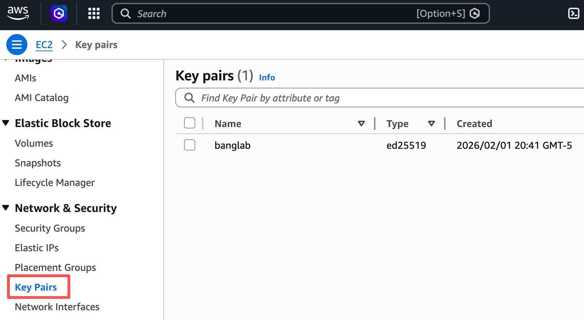
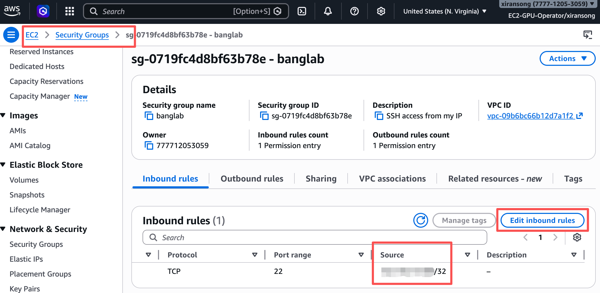

# SSH Access Setup

This page prepares SSH access for EC2 instances.

Before starting, complete local machine setup:

```bash
make doctor
make configure-aws-sso
make aws-login
make aws-whoami
```

This workflow creates:

```text
local private key: ~/.ssh/<OWNER>
local public key: ~/.ssh/<OWNER>.pub
AWS key pair: <OWNER>-key
AWS security group: <OWNER>-ssh
```

For Taki Shiina:

```text
local private key: ~/.ssh/takishiina
local public key: ~/.ssh/takishiina.pub
AWS key pair: takishiina-key
AWS security group: takishiina-ssh
```

## What This Setup Does

SSH access has two parts:

- an **SSH key pair**, which proves that your laptop is allowed to connect
- a **security group**, which allows network traffic to reach the instance

The private key stays on your laptop. AWS only receives the public key.

## Ownership Rules

The toolbox uses your `OWNER` value from `config.env`.

Key pairs are imported with:

```text
Owner=<OWNER>
Name=<OWNER>-key
```

Security groups are created with:

```text
Owner=<OWNER>
Name=<OWNER>-ssh
```

The current permission set enforces owner tags for both key pairs and security
groups. The toolbox creates or imports these AWS resources with `Owner` and
`Name` tags, and it should not silently create untagged resources.

## Step 1: Check SSH Setup Status

Run:

```bash
make ssh-status
```

This should report:

- whether the local private key exists
- whether the local public key exists
- whether the AWS key pair exists
- whether the AWS key pair has the expected `Owner` tag
- whether the default VPC exists
- whether the security group exists
- whether the security group has the expected `Owner` tag
- which SSH inbound rules are currently configured

## Step 2: Create a Local SSH Key

Run:

```bash
make create-key
```

This creates:

```text
~/.ssh/<OWNER>
~/.ssh/<OWNER>.pub
```

The command should refuse to overwrite an existing key.

## Step 3: Import the Public Key to AWS

Run:

```bash
make import-key
```

This imports:

```text
~/.ssh/<OWNER>.pub
```

as:

```text
<OWNER>-key
```

The AWS key pair should be tagged with `Owner` and `Name`. If a key pair with
the same name already exists, the command checks that its `Owner` tag matches
your `OWNER` value.

## Step 4: Create Your SSH Security Group

Run:

```bash
make create-security-group
```

This creates a security group in the default VPC:

```text
<OWNER>-ssh
```

The security group should be tagged with `Owner` and `Name`.

If the account has no default VPC, the command should stop and explain the
problem.

## Step 5: Add an SSH Rule for Your Current Location

Run:

```bash
make add-ssh-rule SSH_RULE_NAME=home
```

The toolbox detects your current public IP address and adds an SSH inbound rule:

```text
TCP 22 from <current-public-ip>/32
```

The rule description is:

```text
<OWNER>-<SSH_RULE_NAME>
```

Examples:

```bash
make add-ssh-rule SSH_RULE_NAME=home
make add-ssh-rule SSH_RULE_NAME=lab
```

This lets you keep separate rules for different places. The command should not
remove old rules automatically.

**Important**: The IP address of your place can be changing. If you find that you can't ssh to an instance due to the changed IP, review and update ssh rules with AWS Console and `make add-ssh-rule`. 

## Step 6: Check Status Again

Run:

```bash
make ssh-status
```

You should now see:

- local key files present
- AWS key pair present
- security group present
- at least one SSH rule for your current location

## AWS Console: Review SSH Resources

The CLI is the recommended way to create or import SSH resources because it
applies the expected `Owner` and `Name` tags.

The AWS Console is useful for inspection. Open the AWS Console through the AWS
Access Portal, select the BangLab account and `EC2-GPU-Operator` permission
set, then set the region to:

```text
us-east-1
```

Go to **EC2 -> Key Pairs** to review your AWS key pair:

```text
<OWNER>-key
```



Go to **EC2 -> Security Groups** to review your SSH security group:

```text
<OWNER>-ssh
```

Open the security group and check **Inbound rules** to see the current SSH
rules. Each rule should allow TCP port `22` from a specific `/32` public IP
address, with a description like:

```text
<OWNER>-home
<OWNER>-lab
```



## EC2 Workflows

EC2 launch commands use:

```text
KEY_NAME=<OWNER>-key
SECURITY_GROUP_NAME=<OWNER>-ssh
```

The SSH command will look like:

```bash
ssh -i ~/.ssh/<OWNER> ubuntu@<PUBLIC_IP>
```

For Taki:

```bash
ssh -i ~/.ssh/takishiina ubuntu@<PUBLIC_IP>
```

---

For EC2 launch, continue to:

```text
docs/ec2-instance-lifecycle.md
```
